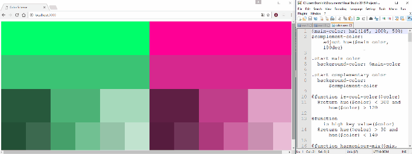

# Color Scheme Generator based on [Practical Color Theory for People Who Code][1]

This project automates the process outlined in the article above and generates HTML and CSS files that, together, show a page like this:


## How to use

First, you need to clone the repository:

```
git clone https://github.com/Domysee/ColorSchemeGenerator.git
```

Then you need to install the `npm` dependencies:

```
cd ColorSchemeGenerator

npm install
```

**Note:** This project assumes you have `npm` set up and `gulp-cli` installed globally. If you don't know how to do that, read [A short Introduction to npm][2] of my blogpost [Learning Gulp for Website Minification][2].

The last step is to start the Gulp task that does the heavy lifting:

```
gulp compile-sass:watch
```

It boots up a local server and automatically opens the page in you default browser. If it does not, it is available under [http://localhost:3000/](http://localhost:3000/).  
The task watches all changes to `colors.sass`, and immediately updates the page when something changd. This is the resulting behavior:



### I don't like immediate Changes

If you don't like this behavior, and rather update manually, you can do this by not running 

```
gulp compile-sass:watch
```

and instead recompile the SASS using 

```
gulp compile-sass
```

every time you want the color scheme updated. Keep in mind that after doing this, you have to refresh the page to see the updated page.

[1]:https://tallys.github.io/color-theory/
[2]:http://domysee.com/blogposts/Blogpost%2014%20-%20Learning%20Gulp%20for%20Website%20Minification/